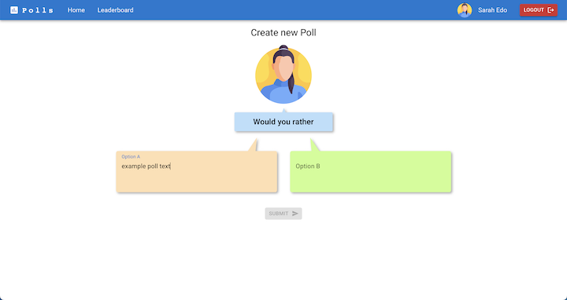

<!-- PROJECT LOGO -->
 

  

<h3 align="center">Polls</h3>
  

    An Employee Polls Web App
     
  

## About
* This polling app allows you to create and answer polls submitted by yourself or other users 

    

 

* Easily select between two choices to answer a poll 

    

* See detailed poll statistics upon answering a poll 

    

* Create your own polls 

    

## Instructions
After cloning, from within the repository run:

### `npm install`
Installs the required dependencies.

### `npm start`
Runs the app in the development mode.\
Open [http://localhost:3000](http://localhost:3000) to view it in your browser.

### `npm test`
Runs the provided function and component tests.

### `npm run build`

Builds the app for production to the `build` folder.

## Acknowledgments
This project was bootstrapped with [Create React App](https://github.com/facebook/create-react-app). 
The app has been built with a great contribution of the following libraries:
+ [MUI](https://mui.com/)
+ [React Minimal Pie Chart](https://www.npmjs.com/package/react-minimal-pie-chart)